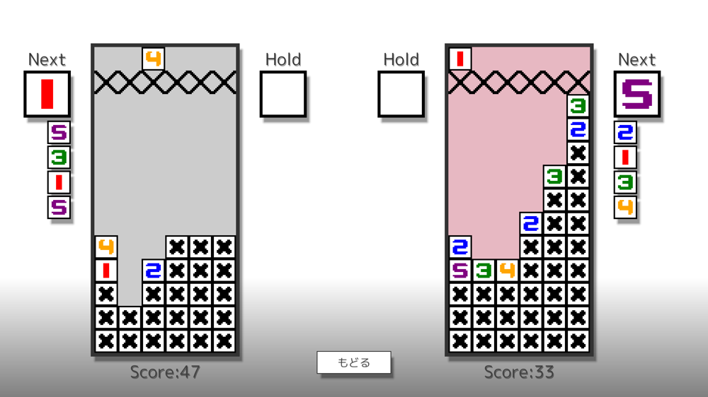

# HitsujiRere🐏

## Profile

- Name: Hitsuji Rere
- Twitter: [@HitsujiRere](https://twitter.com/HitsujiRere)
- GitHub: [@HitsujiRere](https://github.com/HitsujiRere)
- AtCoder: [@Deji](https://atcoder.jp/users/Deji)
    - Highest Rating: 1234
- PAST #3
    - Grade: Intermediate
    - Score: 76
- Qiita
    - [@HitsujiRere](https://qiita.com/HitsujiRere)
- HatenaBlog
    - [HitsujiRere](https://hitsujirere.hatenablog.com/)

## About

My web page is https://hitsujirere.github.io

<!-- 
## Products

### Siritori

You can challenge how long you can keep playing Shiritori, and you can battle the CPU.

Made with JavaScript.

https://hitsujirere.github.io/Siritori/

### Hex Calcurator

This is a hexadecimal function calculator.

Made with Uno-Platform and C#.

https://hexcalcurator.azurewebsites.net (Stopping Now)

### Just 10 Game

It's a game to make 10.

Made with C++ and C++ Library Open-Siv-3D.

https://scrapbox.io/hitsujirere-projects/Just10Game

https://twitter.com/HitsujiRere/status/1243791294679240711?s=20

https://youtu.be/mSAGdvujaFc

### Yudetamago 2
It's a click action game to make a boiled egg.

Made with C++ and C++ Library Open-Siv-3D.

https://scrapbox.io/hitsujirere-projects/ゆでたまご２

 -->
